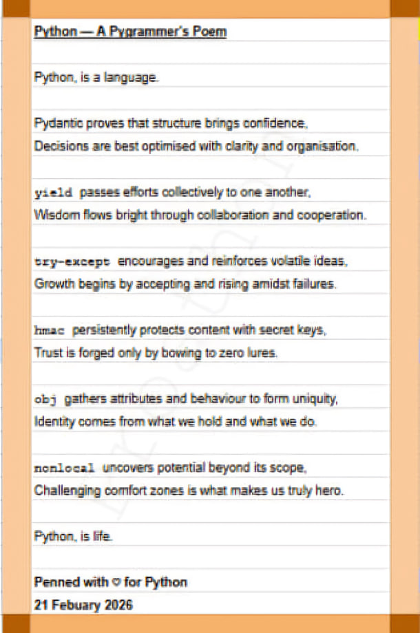

# My-Ankimon-Contributions

Hub for my Ankimon contribution workflow.

## Ankimon's Source Code
> Main -- https://github.com/Unlucky-Life/ankimon
> 
> Experimental Version -- https://github.com/Unlucky-Life/ankimon
## Ankimon's Discord
> https://tinyurl.com/ankimondiscord

## Disclaimer:
These projects are fan-made and are not affiliated with or endorsed by Nintendo or The Pokémon Company.
Pokémon and all related names, characters, images, and assets are the property of their respective owners.
This project is created for learning and entertainment purposes. Any support received is directed toward the development of the program(s) themselves.
If requested by the rights holders, any infringing content will be removed.

## Python Forever

## Happy Coding!
